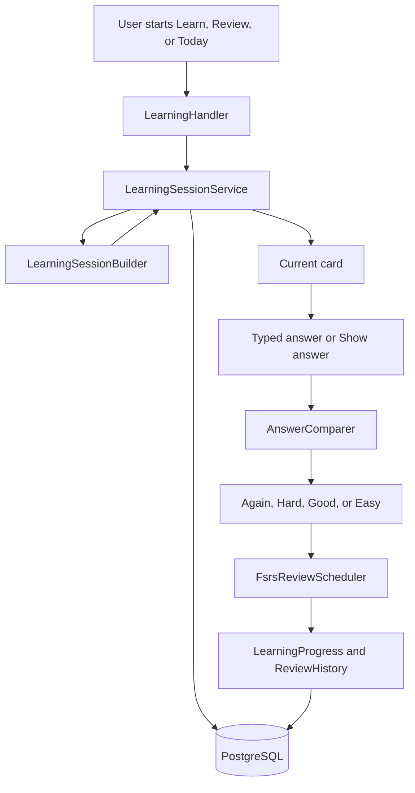
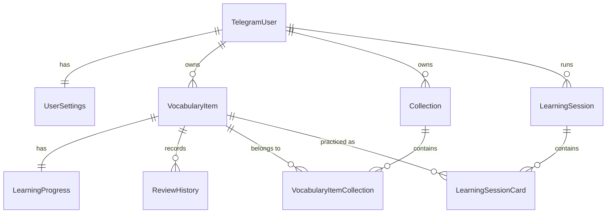

# LexiLoop

A Telegram bot for keeping your own vocabulary and reviewing it on a schedule.

[](https://dotnet.microsoft.com/)
[](https://www.postgresql.org/)
[](https://core.telegram.org/bots/api)

LexiLoop runs inside Telegram. You save words and phrases there, put them in collections, and practice them in short sessions. Each item is scheduled in two directions: foreign text to translation, and translation back to foreign text.

It exists so that vocabulary practice can stay in a chat you already open, without a separate learning app.

## Features

- Add words and phrases one line at a time, with an optional pronunciation.
- Import CSV, TSV, or JSON, with a preview before a file import is saved.
- Treat text that contains a space as a phrase, unless JSON sets the type explicitly.
- Skip duplicates that match an existing foreign text and translation, ignoring case.
- Browse vocabulary, filter it, and open a single item.
- Mark items as favorites.
- Create collections, rename and delete them, and add or remove items.
- Move every uncategorized item into a collection at once.
- Share a collection with a Telegram link. Someone else can preview it and copy a snapshot into their own lists.
- Enable items for learning, then run a Learn, Review, or Today session.
- Choose a direction: foreign to translation, translation to foreign, or mixed.
- Type an answer or reveal the card and rate it Again, Hard, Good, or Easy.
- Schedule the next review with a per-direction FSRS-style interval.
- Show a session summary, including typed answers that did not match.
- Show statistics: counts, due items, today's accuracy, streaks, and this week's activity.
- Send one daily review reminder when notifications are turned on and something is due.
- Change the daily new-item limit and the reminder time.

## Getting started

You need:

- the [.NET 9 SDK](https://dotnet.microsoft.com/download/dotnet/9.0)
- a Telegram account
- a bot token from [@BotFather](https://t.me/BotFather)
- PostgreSQL
- the `dotnet-ef` tool, to apply migrations

Docker is optional. The repository includes a `Dockerfile`, and it is not required to run the bot locally. Any PostgreSQL server works. LexiLoop does not depend on a particular database host.

```bash
git clone https://github.com/OleksandrHutsul/LexiLoop.git
cd LexiLoop
```

Then create the bot, point LexiLoop at PostgreSQL, apply migrations, and run the project. The next sections are in that order.

## Creating the Telegram bot

Open [@BotFather](https://t.me/BotFather), create a bot, and copy the token. Give the bot a username. Share links are built from that username.

Keep the token out of the repository. Locally, store it with user secrets from the project directory:

```bash
dotnet user-secrets set "Telegram:BotToken" "YOUR_BOT_TOKEN"
```

The project id in `LexiLoop.csproj` is `LexiLoop-Local-Secrets`.

In deployment, set either of these. `TELEGRAM_BOT_TOKEN` is read first:

```text
TELEGRAM_BOT_TOKEN=YOUR_BOT_TOKEN
```

```text
Telegram__BotToken=YOUR_BOT_TOKEN
```

Startup fails if neither value is present.

## Database setup

LexiLoop uses PostgreSQL through Entity Framework Core. The context is `LexiLoopDbContext`.

Create a database and a user that can connect to it. Put the connection string in user secrets:

```bash
dotnet user-secrets set "ConnectionStrings:DefaultConnection" "Host=localhost;Port=5432;Database=lexiloop;Username=YOUR_USER;Password=YOUR_PASSWORD"
```

The configuration key is `ConnectionStrings:DefaultConnection`. In deployment the environment variable is:

```text
ConnectionStrings__DefaultConnection=Host=localhost;Port=5432;Database=lexiloop;Username=YOUR_USER;Password=YOUR_PASSWORD
```

Migrations live in `Data/Migrations`. The application does not apply them on startup.

Install the EF Core tool that matches the design package (`9.0.20`), then update the database from the repository root:

```bash
dotnet tool install --global dotnet-ef --version 9.0.20
dotnet ef database update
```

`dotnet ef` starts `Program.cs`, so the connection string has to be configured before this command. If that database does not exist yet and the PostgreSQL role is allowed to create databases, `database update` creates it and then applies the migrations.

There is no design-time `DbContext` factory. The same startup path used by the bot is what EF Core uses.

## Configuration

`appsettings.json` contains logging levels, an empty `Telegram:BotToken`, and the default time zone. It does not contain a connection string.

For local development, prefer user secrets. For deployment, prefer environment variables. .NET maps `Section__Key` to `Section:Key`.

| Key | Environment variable | Required | Default | Purpose |
|---|---|---|---|---|
| `ConnectionStrings:DefaultConnection` | `ConnectionStrings__DefaultConnection` | Yes | none | PostgreSQL connection string |
| `Telegram:BotToken` | `Telegram__BotToken` | Yes, unless `TELEGRAM_BOT_TOKEN` is set | empty | Bot token read from configuration |
| `TELEGRAM_BOT_TOKEN` | `TELEGRAM_BOT_TOKEN` | Yes, unless `Telegram:BotToken` is set | none | Bot token read directly from the environment. This value wins when both are set |
| `Time:DefaultTimeZone` | `Time__DefaultTimeZone` | No | `Europe/Berlin` | Time zone used for "today", streaks, the daily new-item window, and reminder time |

`Time:DefaultTimeZone` must be an id that `TimeZoneInfo` can load, such as `Europe/Berlin`. It is one zone for the whole process. Users do not have their own time zone setting.

These user settings are stored per user in `UserSettings`. They are changed in the bot, not in configuration:

| Setting | Default for a new user | What it does |
|---|---|---|
| New items per day | 5 | Caps how many unseen directions can be introduced during the local day. Any positive whole number is accepted |
| Review notifications | Off | Turns the daily reminder on or off |
| Review time | 19:00 | Local time, in `Time:DefaultTimeZone`, when the reminder may be sent. 24-hour `H:mm` or `HH:mm` |
| Learning mode | Mixed | Stored and shown in Settings. Learn and Review still ask for a direction. `/today` always starts Mixed |
| Show pronunciation | Yes | Stored and shown in Settings. Lists and cards show pronunciation whenever the item has one |

Logging levels in `appsettings.json` can be overridden with the usual `Logging__LogLevel__...` variables.

## Running locally

From the repository root:

```bash
dotnet restore
dotnet run
```

On startup the process checks the connection string and the bot token, then starts two background services:

- `TelegramBotWorker` calls `getMe`, deletes any existing webhook, registers the command menu, and long-polls for messages and callback queries.
- `ReviewNotificationWorker` wakes up once a minute and sends due-review reminders.

The bot is ready when the log says it is starting as `@your_bot_username`. Open that bot in Telegram and send `/start`.

Stop it with Ctrl+C. A new process deletes the webhook again and continues polling. Pending CSV imports and in-progress collection renames are kept in memory, so they are dropped when the process stops.

The same polling behavior is what a deployed process uses. There is no webhook mode in this repository.

## Telegram commands

These commands are registered in the Telegram menu:

| Command | Purpose |
|---|---|
| `/today` | Show due items, new items still allowed today, the current streak, and start a mixed session |
| `/add` | Add one or more `foreign - translation` lines |
| `/import` | Import a CSV/TSV file or a JSON array |
| `/list` | Browse vocabulary |
| `/learn` | Choose a source, enable items, choose a direction, and start a learn session |
| `/review` | Show how many items are due, then choose a direction and review them |
| `/collections` | List collections. `/collections Name` creates one |
| `/stats` | Show vocabulary and review statistics |
| `/settings` | Change the learning pool, daily limit, reminder, and the stored learning preferences |
| `/help` | Show the command list |

`/start` and `/cancel` work and are not part of the registered menu. `/start` sends the welcome text. `/start share_<token>` opens a shared collection. `/cancel` leaves add, import, settings, and collection-name input.

The reply keyboard under the message repeats the main commands: Add, Import, Vocabulary, Collections, Learn, Review, Statistics, Settings, and Help.

Other actions are buttons:

- Vocabulary filters, item details, favorites, and collection membership.
- Learn source, item count, and direction.
- Show answer, then Again, Hard, Good, and Easy.
- CSV header and column mapping, then import confirmation.
- Collection create, rename, delete, edit items, and share.
- Settings, including the learning pool.

`/stats` reports total items, words, phrases, new, learning, learned, due now, reviews today, today's correct-answer percentage, the current and longest streak, and items added, learned, and reviewed in the last 7 local days including today.

In those counts, an item is new when neither direction has been reviewed. It is learned when both directions are in the Review state. Anything in between is learning. "Correct" means the rating was Hard, Good, or Easy. Again is the incorrect rating. A streak is a run of local dates that contain at least one review. The current streak includes today when you have reviewed today, and otherwise counts backward from yesterday.

## Typical user flow

```text
/start
   ↓
/add or /import
   ↓
Items are saved and stay out of the learning pool
   ↓
Optionally group them into collections or favorites
   ↓
/learn
   ↓
Choose All words, Favorites, or a collection
   ↓
Choose how many items to enable
   ↓
Choose a direction
   ↓
Type an answer, or tap Show answer
   ↓
Rate Again, Hard, Good, or Easy
   ↓
That direction's next review time is saved
   ↓
/review or /today later, when something is due
```

Review uses items that are already enabled. It does not ask for a collection. Today starts a mixed session over the same enabled pool and also includes new items that are still inside today's limit.

## Adding vocabulary

`/add` switches the user into add mode. Send one or more lines:

```text
foreign text - translation
foreign text - translation - pronunciation
```

The separator is space, hyphen, space. Example:

```text
der Tag - день - деа таак
Guten Morgen - Доброго ранку - ґуутен моаґен
```

Foreign text and translation are required. Pronunciation is optional. If the foreign text contains a space, the item is stored as a phrase. Otherwise it is a word.

`VocabularyParser` parses the lines. `VocabularyService.AddAsync` trims the fields, drops empty ones, and skips duplicates. A duplicate is the same foreign text and translation for that user, compared case-insensitively. Pronunciation is not part of the key. The same pair repeated in one message is skipped as well.

Each saved item gets a `LearningProgress` row and is stored with learning disabled. It appears in `/list` immediately. It enters a session only after a Learn or learning-pool action enables it.

Foreign text, translation, and pronunciation are limited to 500 characters.

Adding does not place the item in a collection. After an import, the bot offers an "Organize uncategorized" button. From an item you can also open Collections and tap a list.

## Importing vocabulary

`/import` accepts a CSV or TSV upload, or a JSON array pasted as a message.

### JSON

Send a JSON array while import mode is active. Property names are case-insensitive.

```json
[
  {
    "word": "der Tag",
    "translation": "день",
    "pronunciation": "деа таак",
    "type": "word"
  },
  {
    "word": "Guten Morgen",
    "translation": "Доброго ранку",
    "type": "phrase"
  }
]
```

`word` and `translation` are required. `pronunciation` is optional. `type` is `word` or `phrase`. If `type` is omitted, a space in `word` makes it a phrase. JSON is saved immediately. There is no extra confirmation step. Invalid items are reported, and valid items are still saved.

A `.json` file upload is rejected. The file path accepts `.csv` and `.tsv` only.

### CSV and TSV

Upload a `.csv` or `.tsv` file of at most 20 MB. `CsvVocabularyParser` decodes UTF-8, UTF-16 with a BOM, and, when the bytes are not valid UTF-8, Windows-1251 if the text has a run of Cyrillic letters, otherwise Windows-1252.

It tries semicolon, comma, and tab, and keeps the delimiter that gives the most consistent row width. Recognized headers add to that score. If none of those delimiters produce at least two columns, it splits lines on a spaced hyphen, en dash, or em dash.

Recognized headers, after letters and digits are kept and lowercased:

| Column | Accepted names |
|---|---|
| Word | `word`, `foreign`, `term`, `german`, `english`, `wort`, `vocabulary`, `front`, `source` |
| Translation | `translation`, `meaning`, `ukrainian`, `bedeutung`, `back`, `target`, `definition` |
| Pronunciation | `pronunciation`, `transcription`, `phonetic`, `ipa`, `aussprache` |

When the word and translation headers are both found, those columns are used and the header row is not imported. Otherwise:

- 2 columns and no recognized headers: column 1 is the word, column 2 is the translation, and the first row is data.
- 3 columns and no recognized headers: column 1 is the word, column 2 is the pronunciation, column 3 is the translation, and the first row is data.
- Any other unrecognized layout: the bot asks whether the first row is a header, then asks you to pick the word, translation, and optional pronunciation columns.

Header example:

```csv
word,pronunciation,translation
gehen,геєн,йти
Guten Morgen,гутен морген,доброго ранку
```

Two-column example, with or without a header:

```csv
word,translation
gehen,йти
```

Spaced-dash lines follow the same column rules. Two fields are word and translation. Three fields without a header are word, pronunciation, and translation:

```text
gehen - йти
der Tag - деа таак - день
```

That three-field order is different from `/add`, where the third field is pronunciation and the second is translation.

Quoted fields are supported. Empty rows are ignored. A row needs both a word and a translation. A space in the word makes it a phrase. Duplicate rows inside the file are skipped using a case-insensitive word and translation pair.

Before anything is written, the bot shows a preview: rows found, valid unique rows, rows already in your vocabulary, in-file duplicates, invalid rows, the separator, and up to three sample items. Confirm with Import. Rows already stored for that user are left unchanged.

Imported items are not added to a collection and are not enabled for learning.

## Collections

A collection is a named list owned by one user. Names are trimmed and must be 1–100 characters. Two lists for the same user cannot share the same name. The comparison is case-sensitive, so `German` and `german` are different names.

Create one from `/collections`, with `/collections Travel`, or with the Create collection button. Open a list to rename it, delete it, edit membership, share it, or start learning from it.

An item can belong to several collections. Membership is the `VocabularyItemCollection` link between `VocabularyItem` and `Collection`. Adding an item that is already in the list does nothing. The database primary key is `(VocabularyItemId, CollectionId)`.

Deleting a collection removes the list and its membership rows. The vocabulary items stay, including their membership in other lists.

Items with no collection appear under Uncategorized. From that view you can add all of them to an existing collection, or create a collection and add them in the same step.

Favorites are a flag on the item, not a collection. You can filter the vocabulary list to favorites and start Learn from that set.

Learn and Random practice on a collection screen both start the same learn flow for that collection. Review and Today always use the whole learning pool.

### Sharing

Share list creates a token if the collection does not have one yet, and an **Open share link** button. The link has this shape:

```text
https://t.me/<bot-username>?start=share_<token>
```

Opening it runs `/start` with that payload. The recipient sees the collection name, owner, and size, can preview items, and can tap **Add to my lists**.

That action copies a snapshot:

- a new collection is created for the recipient, with a numeric suffix if the name is already taken
- items they already have, matched case-insensitively on foreign text and translation, are reused
- missing items are created with learning disabled, favorites off, and fresh progress
- the same share can be imported only once
- the owner cannot import their own link

Disable share link clears the token. Old links stop opening. Copies that were already imported stay. Later edits to the original list are not pushed to those copies.

## Learning sessions

A session is created by `LearningSessionService` and stored before the first card is shown. `LearningSessionBuilder` chooses the cards. `FsrsReviewScheduler` updates a direction after the user rates it.



1. Learn asks for a source: all words, favorites when you have some, or a collection. Review asks only for a direction. Today uses every enabled item and Mixed.
2. On Learn, the next step asks how many items to make available: 10, 20, 50, 100, or all. Only counts that fit the source are shown. The oldest disabled items in that source are enabled, up to the chosen number. Items that are already enabled stay enabled.
3. The session pool is the enabled items in the selected source. Review and Today ignore the collection and favorites filters and use every enabled item.
4. Due cards are directions that have been reviewed before and whose next review time is now or earlier.
5. Learn and Today also take unseen directions, oldest items first, up to the remaining daily allowance. Review does not.
6. `LearningSessionBuilder` orders those cards. The order is saved on `LearningSessionCard` rows.
7. The prompt is the foreign text, or the translation when the direction is the other way. The message shows the card position.
8. A typed message is checked with `AnswerComparer` while the answer is still hidden. Show answer skips that check.
9. The user then rates the card. The rating, not the typed match, is what reschedules the card.
10. The current index advances. When the last card is rated, the session is marked completed and a summary is sent.
11. Each rating writes the FSRS fields on that direction, increments the progress counters, and appends a `ReviewHistory` row. A wrong typed answer is also stored on the card and listed in the summary.

Starting a session marks any other active session for that user as cancelled. The session message id and a `Version` column are updated with the card, so an outdated button is ignored.

The summary counts Again as incorrect and Hard, Good, and Easy as correct. Typed mistakes are grouped by item.

## Vocabulary selection

`LearningSessionBuilder` answers which cards appear, and in what order. `LearningSessionService.CreateAsync` decides which items are loaded first.

The loaded set is:

- every enabled item in the source that is due in at least one direction
- for Learn and Today, the oldest enabled items that still have an unseen direction in the selected mode, limited by today's remaining new-item allowance

A direction is unseen when its review count is 0. A direction is due when its review count is greater than 0 and `NextReviewAt` is at or before the current UTC time.

The daily allowance starts at the user's new-items-per-day value. A direction counts against today when every review of that direction happened today. Reviewing an older card again does not use up the allowance. The allowance is per user, so new cards from one collection count against Learn from another collection on the same local day.

Due cards are always included. They do not consume the new-item allowance.

Inside the builder:

- Due learning and relearning cards come first, then other due cards, then new cards.
- Due cards are shuffled. New cards are shuffled, then capped again by the same allowance.
- In Mixed mode, each unseen item contributes one unseen direction, chosen at random. A direction that is already due is added as well, so one item can appear twice: once for a due direction and once for an unseen one. If both directions are due, both are added.
- The same item id is not added twice from the input list. The two directions are still separate cards.
- When a choice exists, the next card prefers the opposite direction from the previous card.
- Related cards are kept at least 4 positions apart when another card is available.

Two cards are related when they are the same item, or their normalized foreign texts are similar, or their normalized translations are similar. Normalization lowercases the text, removes diacritics, keeps letters and digits, drops the German articles `der`, `die`, `das`, `den`, `dem`, `des`, `ein`, `eine`, `einer`, `einem`, and `einen`, and joins the remaining words. Keys shorter than 3 characters are never similar. Longer keys are similar when they are equal, one contains the other, or they share a prefix of at least 4 characters that is also at least 60% of the shorter key.

If every remaining card is related to the recent ones, the builder relaxes that rule and still places a card.

## Answer checking

`AnswerComparer` compares the typed text with one expected string: the translation, or the foreign text, depending on the card direction.

The check:

- normalizes both strings to Unicode NFC
- collapses whitespace to single spaces and trims the ends
- compares them while ignoring case

`Guten Morgen` matches `guten   morgen`. `der Tag` does not match `Tag`. Punctuation, articles, and extra words are kept. There is no fuzzy match and no list of alternative translations.

After the check, the user still chooses Again, Hard, Good, or Easy. Show answer reveals both sides and goes straight to that rating.

## Review scheduling

Each direction has its own schedule on `LearningProgress`: state, stability, difficulty, interval in days, review count, lapse count, last review, and next review. The states are New, Learning, Review, and Relearning.

`FsrsReviewScheduler` calculates the next state. The target retention used by the interval math is 0.90. For a card that has graduated, the interval in days is the stability rounded to the nearest integer, with a minimum of 1 day.

The first time a direction is rated:

| Rating | What happens |
|---|---|
| Again | Stays in Learning and is due again in 10 minutes. Counts as a lapse |
| Hard | Stays in Learning and is due in 8 hours |
| Good | Moves to Review and is due in 3 days |
| Easy | Moves to Review and is due in 16 days |

After that:

| Rating | What happens |
|---|---|
| Again | Moves to Relearning, is due in 10 minutes, and counts as a lapse. Stability is reduced |
| Hard, while the card is still Learning or Relearning | Stays in that state and is due in 12 hours |
| Hard, after the card has graduated | Stays in Review. Stability grows more slowly than for Good, so the next interval is shorter |
| Good | Stays in Review. The interval follows the new stability |
| Easy | Stays in Review. Stability grows further, so the next interval is longer |

Difficulty stays between 1 and 10 and changes the later stability growth. A due card is one whose next review time has been reached. Learn and Today can also introduce cards that have never been reviewed, inside the daily limit.

The level columns on `LearningProgress` are still updated from the interval. The bot does not show them.

## Time and reminders

`AppClock` is the clock used by services. `UtcNow` comes from `TimeProvider` and is stored as UTC. `LexiLoopDbContext` also rewrites any `DateTimeOffset` it is about to save so the offset is zero.

"Today" is the current date in `Time:DefaultTimeZone`, which defaults to `Europe/Berlin`. The daily new-item window, streaks, weekly stats, and the reminder time all use that zone.

`ReviewNotificationWorker` runs every minute. For a user with reminders enabled, it sends at most one message per local day. The message goes out at or after that user's review time, and only when at least one enabled item is due. The text includes the due count and a Start review button. If nothing is due yet, it waits and can still send later that day. `LastNotificationDate` records the day a reminder was sent.

`ReviewNotificationsEnabled` is the switch. New users have it off, with the time set to 19:00.

## Data model



| Entity | Responsibility |
|---|---|
| `TelegramUser` | Telegram id, name, last activity, and the current text-input mode |
| `UserSettings` | Daily new-item limit, stored learning mode, pronunciation flag, reminder switch, reminder time, and the last reminder date |
| `VocabularyItem` | One user's foreign text, translation, optional pronunciation, word or phrase, favorite flag, and whether it is in the learning pool |
| `LearningProgress` | Independent schedule for each direction, plus review and correct/incorrect counters |
| `ReviewHistory` | One row per rating: item, direction, Again/Hard/Good/Easy, and time |
| `Collection` | A user's named list, optional share token, and the token it was imported from |
| `VocabularyItemCollection` | Membership of one item in one collection |
| `LearningSession` | An active, completed, or cancelled session: kind, direction mode, source name, position, and the Telegram message that holds the buttons |
| `LearningSessionCard` | One planned card: item, direction, position, rating, and any typed answer that did not match |

Vocabulary, collections, progress, and sessions all belong to the internal user id created from the Telegram account. Items are not shared globally. A shared collection is copied into the recipient's own rows.

The unique vocabulary key is user, foreign text, and translation. Collection names are unique per user. Share tokens are unique. A user can import a given share token only once.

## Architecture

```text
Telegram long polling
    ↓
TelegramBotWorker
    ↓
TelegramUpdateHandler
    ↓
CommandHandler or a callback handler
    ↓
Vocabulary, import, collection, learning, settings, and statistics services
    ↓
LexiLoopDbContext
    ↓
PostgreSQL
```

`TelegramBotWorker` only receives updates. `TelegramUpdateHandler` creates or refreshes the user, then routes text and button data.

Command and menu text go to `CommandHandler`. Buttons are routed by the callback prefix to `ImportHandler`, `LearningHandler`, `VocabularyHandler`, `CollectionHandler`, or `SettingsHandler`. Collection sharing is handled by `CollectionSharingHandler` through `CollectionHandler`.

Handlers are singletons. The services they call are registered as scoped, and each service method opens its own `LexiLoopDbContext` from the pooled factory. `ReviewNotificationWorker` resolves that factory from a fresh scope on every pass.

The boundaries behind that are:

- `VocabularyParser` and `CsvVocabularyParser` turn text and files into vocabulary inputs.
- `VocabularyService` and `VocabularyImportService` store items and build the CSV preview.
- `CollectionService` owns lists, membership, and share snapshots.
- `LearningSessionService` loads the pool, persists the session, checks typed answers, and applies ratings.
- `LearningSessionBuilder` orders cards.
- `FsrsReviewScheduler` calculates the next interval.
- `AnswerComparer` compares typed text.
- `AppClock` converts UTC instants to the configured local date.
- `ReviewNotificationWorker` sends reminders.
- `StatisticsService` reads the same tables for `/stats`.

CSV confirmation state and the collection being renamed are stored in memory on the singleton handlers. The user's input mode is stored on `TelegramUser`, so add, import, and settings prompts survive a restart even when the in-memory CSV preview does not.

## Project structure

```text
LexiLoop/
├── Bot/
│   ├── Handlers/          Update routing, commands, and button flows
│   ├── Helpers/           Reply keyboard, settings keyboard, callback parsing
│   ├── Keyboards/         Inline keyboards for learn, import, vocabulary, collections
│   ├── Models/            In-memory CSV import state
│   ├── TelegramBotWorker.cs
│   └── TelegramHtml.cs
├── Data/
│   ├── Migrations/        EF Core migrations
│   └── LexiLoopDbContext.cs
├── Models/
│   ├── Entities/          Database entities
│   └── Enums/             Modes, states, ratings, item type
├── Options/
│   └── TimeOptions.cs
├── Services/
│   ├── Interfaces/        Parser, comparer, clock, and scheduler contracts
│   ├── Models/            Inputs, previews, and session plans
│   ├── LearningSessionBuilder.cs
│   ├── LearningSessionService.cs
│   ├── FsrsReviewScheduler.cs
│   ├── AnswerComparer.cs
│   ├── CsvVocabularyParser.cs
│   ├── VocabularyParser.cs
│   └── ReviewNotificationWorker.cs
├── appsettings.json
├── Dockerfile
├── Program.cs
└── LexiLoop.csproj
```

`Program.cs` registers configuration, the DbContext factory, the bot client, services, handlers, and the two hosted workers.

## Tech stack

- C# on .NET 9 (`net9.0`)
- A generic host worker (`Microsoft.Extensions.Hosting` 9.0.20), not an ASP.NET Core web app
- Telegram.Bot 22.10.3.1
- Entity Framework Core, with the design package 9.0.20
- Npgsql.EntityFrameworkCore.PostgreSQL 9.0.4
- PostgreSQL

## Deployment

The process is a long-polling worker. Local `dotnet run` and the Docker image do the same thing. On startup the worker deletes a webhook if one was set earlier, then calls `getMe` and starts receiving updates. It does not listen for HTTP requests, so it does not need a public HTTPS URL.

`Dockerfile` builds with the .NET 9 SDK image and runs `dotnet LexiLoop.dll` on the .NET 9 runtime image. The image does not include PostgreSQL. Pass the token and connection string when you start the container. `appsettings.json` is published with the app, so the time zone stays `Europe/Berlin` unless you override `Time__DefaultTimeZone`.

```bash
docker build -t lexiloop .
docker run --rm -e TELEGRAM_BOT_TOKEN=YOUR_BOT_TOKEN -e ConnectionStrings__DefaultConnection="Host=YOUR_HOST;Port=5432;Database=lexiloop;Username=YOUR_USER;Password=YOUR_PASSWORD" lexiloop
```

Apply migrations before the container starts serving users. The image does not run them.

The repository does not include Compose, systemd, or a webhook endpoint. Run the container, or `dotnet LexiLoop.dll`, on a machine that can reach Telegram and PostgreSQL, and leave the process running.

## Extending LexiLoop

- A new command goes in the `switch` in `Bot/Handlers/CommandHandler.cs`. Add it to `SetMyCommands` in `Bot/TelegramBotWorker.cs` if it should appear in Telegram's menu. A reply-keyboard button also needs an entry in `MainMenuKeyboard` and in `MenuCommand`.
- A new inline button needs a keyboard under `Bot/Keyboards` and a callback prefix. `TelegramUpdateHandler` sends that prefix to a handler.
- A new text import shape belongs in `VocabularyParser`. A new tabular layout belongs in `CsvVocabularyParser`, with the preview and confirm path in `ImportHandler`.
- Answer comparison is `Services/AnswerComparer.cs`.
- Which items are loaded is `LearningSessionService.CreateAsync`. Card order and the related-card rule are `LearningSessionBuilder`.
- Interval changes belong in `FsrsReviewScheduler`.
- A new user setting needs `UserSettings`, a migration, `UserSettingsService`, and a control in `SettingsHandler` and `SettingsKeyboard`.

## Implementation notes

- Timestamps are saved as UTC. `SaveChanges` converts a `DateTimeOffset` whose offset is not zero.
- Migrations are applied with `dotnet ef database update`. Nothing in startup calls `Database.Migrate`.
- New vocabulary is saved with `IsLearningEnabled` false. Sessions only load enabled items.
- Every item has two schedules. A mixed session can show both directions of the same item.
- The card list is fixed when the session is created.
- Rating a card updates progress immediately. Typed correctness is stored for the summary and does not itself change the interval.
- `LearningSession.Version` is a concurrency token. A stale button does not advance the session.
- Related cards are separated by 4 positions when the builder can still find another card. German articles are removed only for that similarity check.
- The daily new-item count is based on the configured local date, not on the server's local zone.
- Reminder delivery is `ReviewNotificationWorker`. The database fields are used.
- CSV preview state and the collection id being renamed live in memory. Input mode lives in the database.
- Deleting a collection does not delete vocabulary.
- Share import copies rows. It does not keep the two collections linked.
- `ForeignToTranslationLevel` and `TranslationToForeignLevel` are written from the interval and are not shown in the chat.

## Security and secrets

Do not commit:

- the Telegram bot token
- the PostgreSQL password or a full connection string
- a real user-secrets file

`appsettings.json` keeps `Telegram:BotToken` empty. Leave it empty and use user secrets or environment variables.

Local:

```bash
dotnet user-secrets set "Telegram:BotToken" "YOUR_BOT_TOKEN"
dotnet user-secrets set "ConnectionStrings:DefaultConnection" "Host=localhost;Port=5432;Database=lexiloop;Username=YOUR_USER;Password=YOUR_PASSWORD"
```

Deployment:

```text
TELEGRAM_BOT_TOKEN=YOUR_BOT_TOKEN
ConnectionStrings__DefaultConnection=Host=YOUR_HOST;Port=5432;Database=lexiloop;Username=YOUR_USER;Password=YOUR_PASSWORD
```

There is no webhook secret. A collection share token is a capability: anyone who opens the link can preview that list and copy it.

## Current limitations

- Vocabulary text cannot be edited or deleted from the bot. A collection can be deleted, and its items remain.
- The learning-mode and show-pronunciation settings are saved and displayed. Session direction is chosen on the Learn and Review buttons, `/today` is always Mixed, and pronunciation is shown whenever the item has one.
- Reminders use one application time zone for every user.
- An unfinished CSV import or collection rename is lost when the process restarts.
- The share screen's **Open share link** button carries the real `t.me` link. The message body shows the literal text `{TelegramHtml.Encode(url)}` where the URL was meant to appear.
- The repository has no automated test project.

## Contact

[](https://www.linkedin.com/in/oleksandr-hutsul-5b2b95254/)

[](mailto:hutsul11oleksandr@gmail.com)
